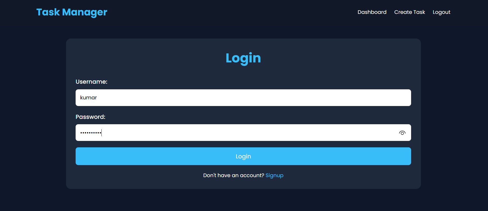
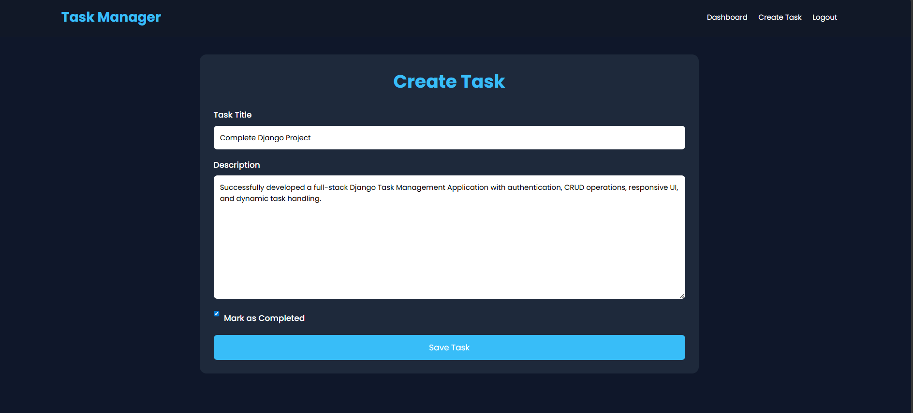
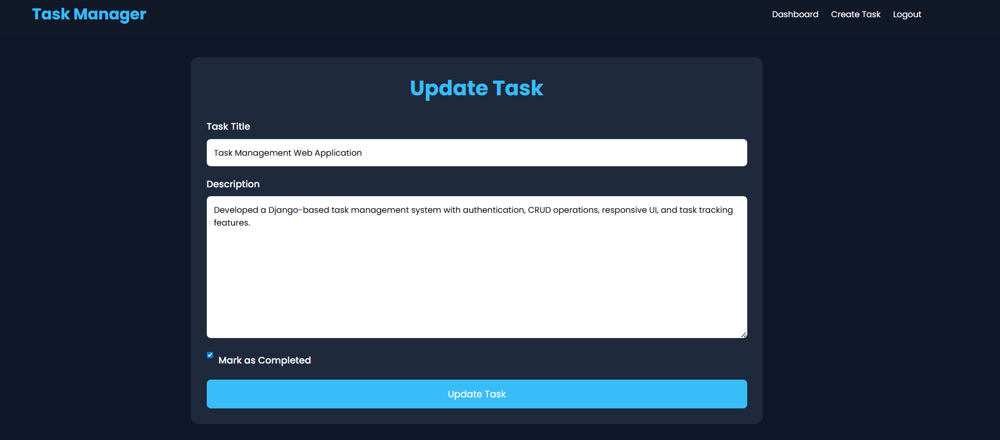
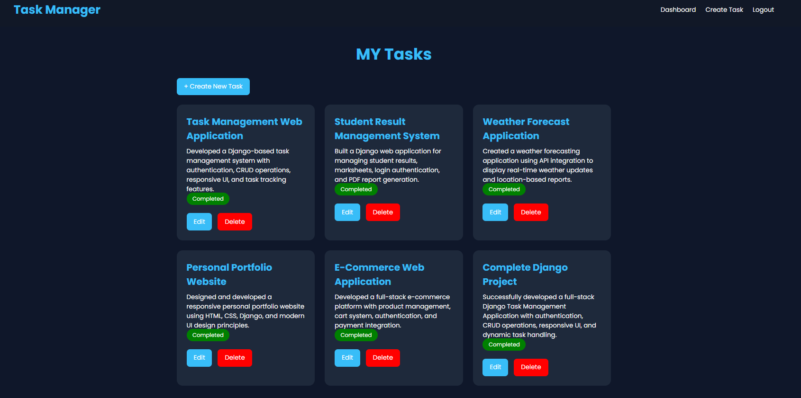

# Task Management Application

A full-stack Django-based Task Management Web Application that allows users to create, update, delete, and track tasks with authentication and responsive UI design.

---

# Features

- User Authentication (Signup/Login/Logout)
- Create Tasks
- Update Tasks
- Delete Tasks
- Track Task Status
- Responsive Design
- Modern Dashboard UI

---

# Technologies Used

- Python
- Django
- HTML5
- CSS3
- SQLite
---

# Usage

1. Open browser
2. Go to:
3. Signup/Login
4. Create and manage tasks

---

# Expected Outcome

This project helps in learning:

- Full-stack Django development
- Authentication system
- CRUD operations
- Responsive UI design

---

## Screenshot

## 👨‍💻 Author

Sachin Kumar

### LinkedIn
[LinkedIn Profile](https://www.linkedin.com/in/sachin-kumar-362b53343/)

### GitHub
[GitHub](https://github.com/SACHIN197-creator)

---

